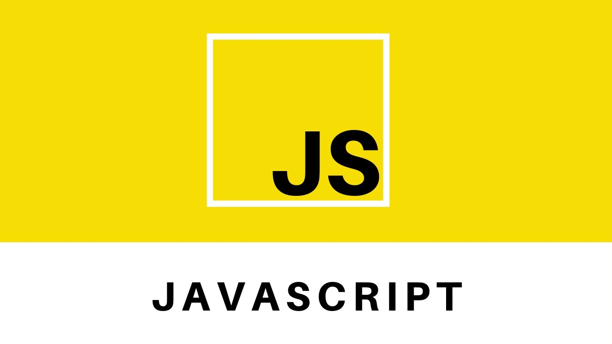

<h1 align="center">
    
</h1>

<h3 align="center">
  JS Rocketseat - Exercícios e Desafios
</h3>

Este projeto armazena os exercícios finais/desafios de cada módulo do curso de Javascript da Rocketseat <a href="https://skylab.rocketseat.com.br/journey/starter"> (JavaScript Starter)</a> 🎓

  
  

  

  
  
  
  
  
   

## Índice dos módulos

- ### [ Módulo 01 - Introdução JavaScript](https://github.com/matheusfbonfim/JavaScript-Rocketseat/tree/master/01-introducao-java-script) 🚀 Done :heavy_check_mark:
- ### [ Módulo 02 - Manipulando a DOM](https://github.com/matheusfbonfim/JavaScript-Rocketseat/tree/master/02-manipulando-DOM) 🚀 Done :heavy_check_mark: 
- ###  [ Módulo 03 - App de ToDos](https://github.com/matheusfbonfim/JavaScript-Rocketseat/tree/master/03-app-de-Todos) :construction: In progress.. :construction:
- ### [Módulo 04 - JS Assíncrono](https://github.com/matheusfbonfim/JavaScript-Rocketseat/tree/master/04-JS-assincrono)

## :memo: License

O projeto está sobre a licença [MIT](./LICENSE) ❤️ 

Gostou? Deixe uma estrelinha para ajudar o projeto ⭐

<!-- Mensagem final -->
<h3 align="center">
Feito com ❤️ por <a href="https://www.linkedin.com/in/matheus-bonfim-448667169/">Matheus Bonfim</a>
  

</h3>
</h3>